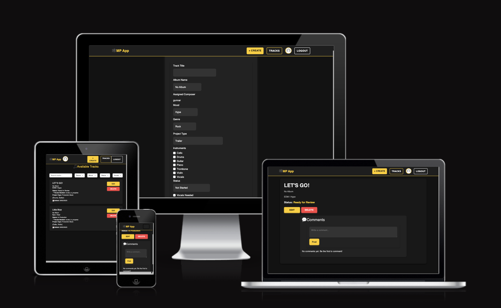
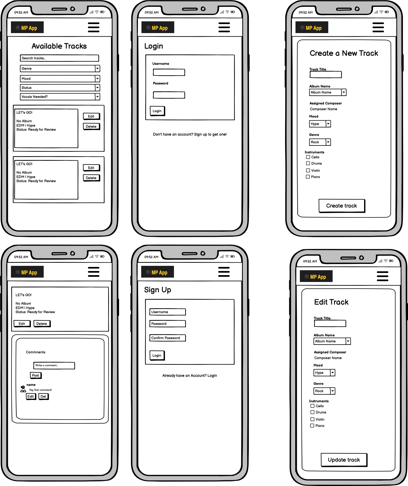
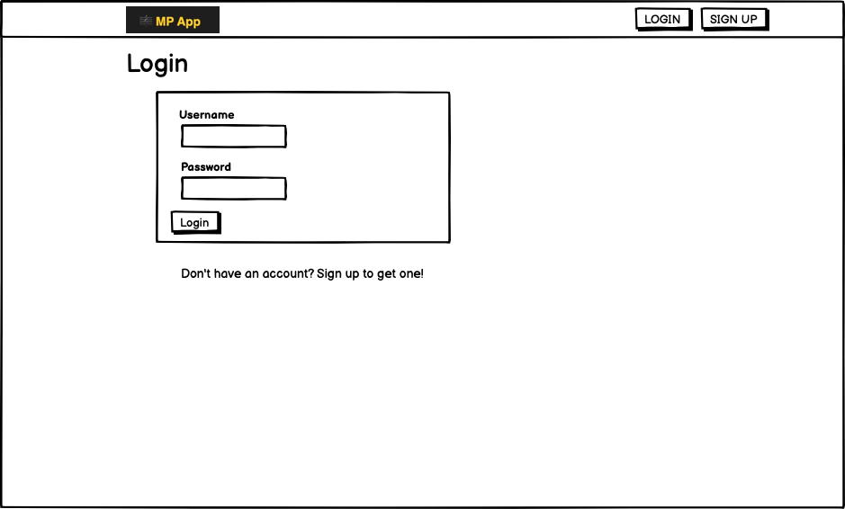
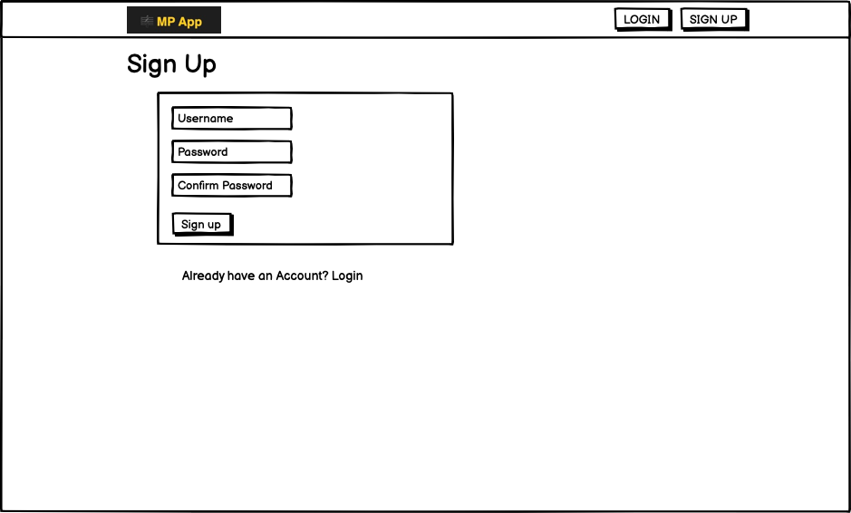
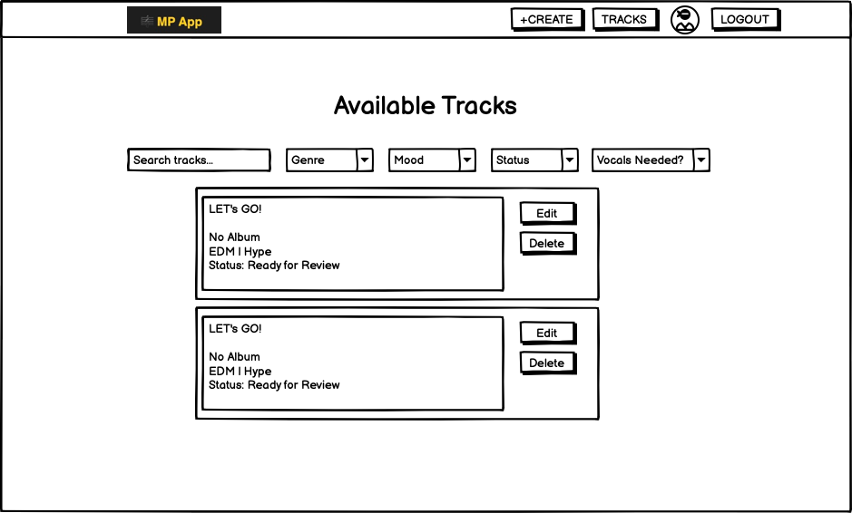
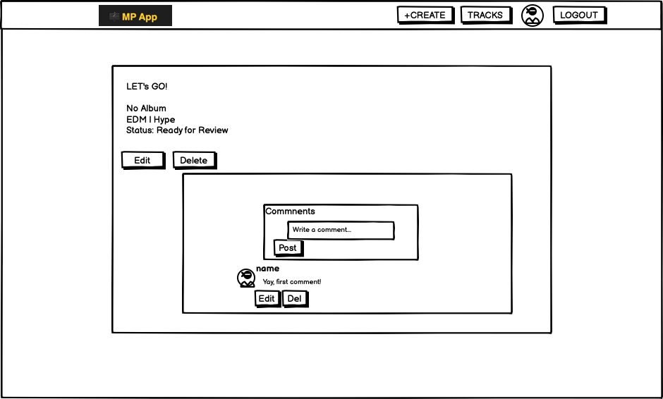
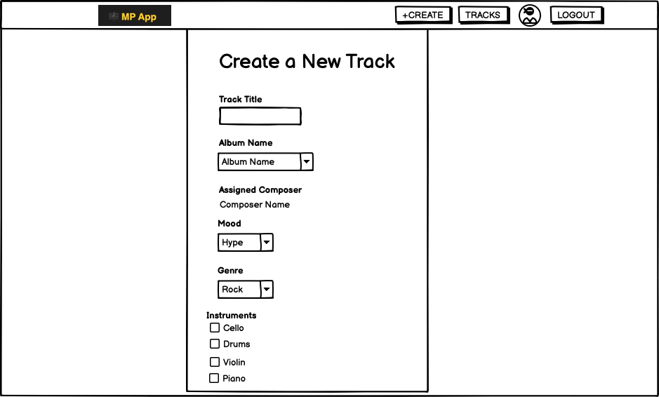
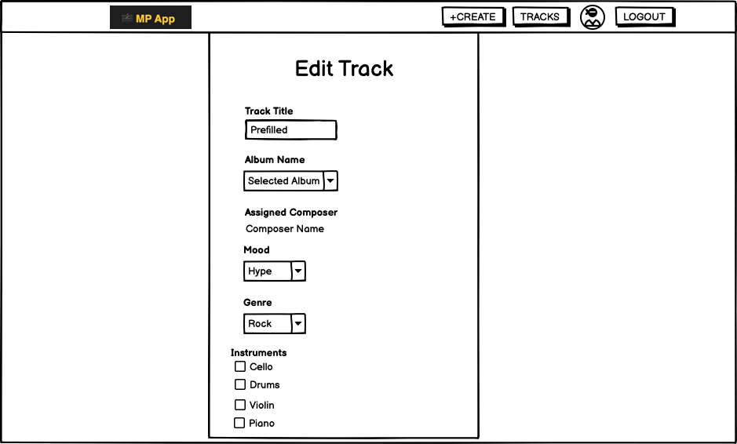
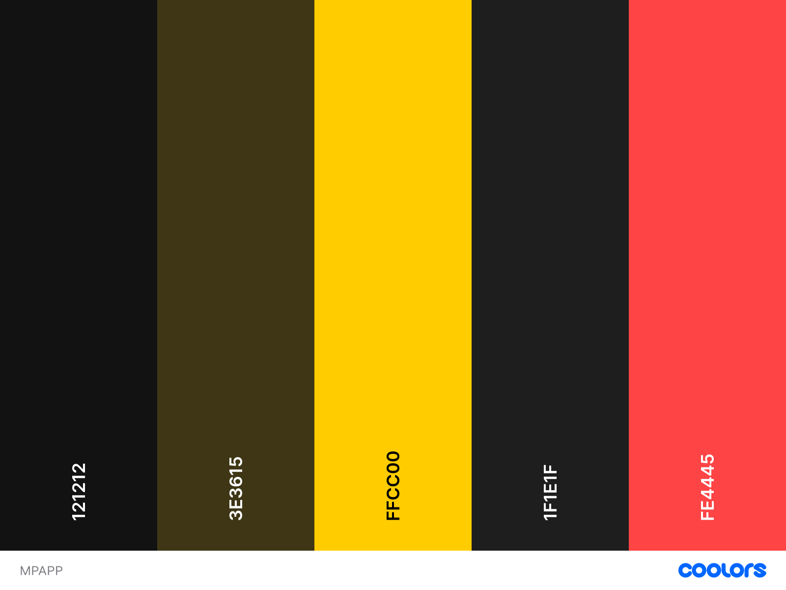

# 🎵 Music Productivity App

## 📌 Introduction

The **Music Productivity App** is designed for **composers, producers, and music professionals** to streamline their workflow. It eliminates tedious admin work, allowing users to efficiently **track, manage, and collaborate** on their compositions in a structured system.



---

## 📋 Table of Contents

-   [Features & User Roles](#features--user-roles)
-   [Filtering & Searching](#filtering--searching)
-   [Comments & Reviews](#comments--reviews)
-   [Future Features](#future-features)
-   [Setup & Deployment](#setup--deployment)
-   [Testing](#testing)
-   [User Stories](#user-stories)
-   [Technologies Used](#technologies-used)
-   [Credits](#credits)

---

## 🖌 UX & Design

### 🎨 Wireframes

The initial wireframes for the project can be found below:

#### 📱 Mobile Wireframes



#### 🖥 Desktop Wireframes








_(These wireframes helped guide the development and ensure a smooth UI/UX experience.)_

### 🎨 Color Palette

The color scheme was carefully selected to ensure **good contrast, readability, and a sleek modern feel** that aligns with the app’s purpose.



-   **Primary Background:** `#121212`
-   **Secondary Background:** `#1F1E1F`
-   **Highlight / CTA (Buttons, Accents):** `#FFCC00`
-   **Secondary Accents / Hover Effects:** `#3E3615`
-   **Warning / Action Color (Delete, Alerts):** `#FE4445`

_(Contrast ratios were considered to meet accessibility guidelines, ensuring strong visibility across different devices.)_

## ✨ Features & User Roles

### 👨‍🎤 **Composers (Full Access)**

✔ Create, edit, and delete tracks.  
✔ Assign **moods, genres, instruments, project type, and track status**.  
✔ Mark tracks as **Ready for Review**.  
✔ Manage comments for **team collaboration**.  
✔ Assign themselves to tracks so others can see who's working on what.  
✔ _(Future Feature)_ Manage albums, upload audio files, and enhance search filters.

### 🎠 **Reviewers (Limited Access)**

✔ View **only** tracks marked as **Ready for Review**.  
✔ _(Future Feature)_ Provide **structured feedback** in a dedicated review thread.  
✔ Cannot create, edit, or delete tracks—**only review & comment**.  
✔ _(Future Feature)_ Set Review Status to **"Needs Revision"**.  
✔ _(Future Feature)_ Track review history & revision counts.  
✔ _(Future Feature)_ Mark tracks as **Completed & Approved**.  
❌ Cannot assign moods, genres, instruments, or statuses.  
❌ Cannot delete or edit composer comments.

---

## 🔍 Filtering & Searching

**Powerful filtering options:**
✔ Search by **title**.  
✔ Filter by:

-   **Genre**
-   **Mood**
-   **Status** (_Not Started, In Progress, Ready for Review, etc._)
-   **Project Type**
-   **Vocals Needed (Yes/No)**

_(Future Feature)_ Advanced filtering & search options.


---

## 📝 Comments & Reviews

### 🎤 **Composer Comments**

✔ Track-specific **team collaboration threads**.  
✔ Owners can **edit & delete** their own comments.  
✔ Link avatars and names to **composer profiles**.

### 📝 **Review Feedback**

✔ _(Future Feature)_ Separate from composer comments (**structured review system**).  
✔ _(Future Feature)_ Reviewers set track status to **"Needs Revision"** if necessary.  
✔ _(Future Feature)_ Review log with **revision history**.  
✔ _(Future Feature)_ Revision counter for **internal tracking (only seen by Composers)**.


---

## 🚀 Future Features

🎿 **Albums** – Tracks can belong to albums for better organization and bulk update tracks.  
🎧 **Audio Uploads** – Attach sound files for easy review.  
🔍 **Enhanced Search** – More filtering & categorization options.  
🎠 **Instrument Management** – Create & categorize instruments.  
🎠 **Genre/Mood/Project Type** – Create & Edit these features.  
📊 **Dashboard & Analytics** – Insights into track progress & team activity.

📊 **Review System** – Reviewers can give feedback, change status on track have a back and forth with the composers.

---

## 🛠 Setup & Deployment

### **1️⃣ Backend (Django REST Framework)**

```bash
# Clone the backend repository:
git clone <backend_repo_url>
cd backend
pip install -r requirements.txt
python manage.py migrate
python manage.py runserver
```

### **2️⃣ Frontend (React 19)**

```bash
# Clone the frontend repository:
git clone <frontend_repo_url>
cd frontend
npm install
npm start
```

### **3️⃣ Deployment** _(Optional: To be expanded if deployed on Heroku or Vercel)_

-   Frontend hosted on **[Vercel/Netlify](documents/deployment.png)**
-   Backend hosted on **[Heroku](documents/deployment.png)**

---

## ✅ Testing

A full breakdown of testing procedures is available in [`TESTING.md`](#).

### **Key Tests**

✔ **CRUD Operations** – Create, edit, delete tracks, comments, and reviews.  
✔ **Filtering & Searching** – Ensure smooth user navigation.  
✔ **User Role Access Control** – Reviewers cannot modify tracks.  
✔ **Authentication & Authorization** – Secure login/logout & user permissions.  
✔ **Responsiveness** – Cross-browser and mobile compatibility.


---

## 📌 User Stories

These user stories outline the core functionalities and user needs addressed in this project:

### User Stories Disclaimer

This app is designed for **two user roles: Composers and Reviewers.**

-   **Composers** have **full access** to create, edit, and manage tracks.
-   **Reviewers** have **limited access** and can only view tracks marked as **"Ready for Review."**
-   **Only Composers can add, edit, or delete tracks.**
-   **Only Composers can assign moods, genres, instruments, and statuses.**
-   **Only Composers can comment on tracks. Reviewers cannot leave comments.**
-   **General features like filtering, sorting, and authentication apply to all users (with limited selections).**

### 🎵 Track Management (CRUD)

**As a Composer, I can create, edit, delete, and view songs/projects**  
_so I can manage my work efficiently._  
✔ Users can create, edit, and delete tracks.  
✔ Required fields must be filled; otherwise, an error message appears.

### 🔍 Filtering & Searching

**As a User, I can filter and search tracks/albums by genre, mood, instruments, progress, name, and date**  
_so I can quickly find what I need._  
✔ Users can filter songs by multiple criteria.  
✔ Users can search for songs by title or keywords.

### 📌 Progress Tracking

**As a User, I can mark a track/project as "In Progress" or "Completed"**  
_so I can track my work._  
✔ Users can update track progress statuses.  
✔ Users can mark specific instruments as completed.

### 💬 Comment System

**As a User, I can leave comments on a track/album**  
_so I can provide feedback or notes._  
✔ Users can comment on tracks.  
✔ Comments are track-specific.  
✔ Users can edit and delete their own comments.

### 🔑 User Authentication (Signup, Login, Logout)

**As a User, I can sign up, log in, and log out**  
_so that my data is secure._  
✔ Users can sign up with username & password.  
✔ Users can log in and receive an authentication token.  
✔ Users can log out and remove their token.  
✔ If credentials are incorrect, an error message appears.

### 📂 Sorting System

**As a User, I can sort tracks by name, date, or progress**  
_so I can organize my work better._  
✔ Users can sort by **date (newest/oldest)**.  
✔ Users can sort **alphabetically**.  
✔ Users can sort by **progress (Completed/In Progress)**.

### 🎧 Upload Audio Preview _(Future Feature)_

**As a User, I want to upload a short audio clip for each track**  
_so that I can preview how it sounds._  
✔ Users can upload an **MP3/WAV** file.  
✔ The audio file plays on the track page.

### 🤝 Collaboration _(Future Feature)_

**As a User, I can invite collaborators to a track/project**  
_so multiple people can track progress._  
✔ Users can **invite collaborators via email**.  
✔ Collaborators can view and edit shared tracks/projects.

---

## 🖥 Technologies Used

✔ **Frontend:** React 19, React Bootstrap, CSS Modules  
✔ **Backend:** Django 4.2, Django REST Framework 3.15  
✔ **Authentication:** JWT, dj-rest-auth  
✔ **Deployment:** _(To be documented)_  
✔ **Database:** PostgreSQL  
✔ **Hosting:** _(Optional: Vercel, Heroku, Netlify, etc.)_

---

## 🙌 Credits

This project was developed as part of a **portfolio submission** for Code Institute.

Big thanks to:

-   **OpenAI & Online Resources** – For debugging & research.
-   **Developers & Peers** – For feedback & best practices.

### Special thanks to:

-   To my amazing parents and their indescribable support
-   To my really good mate Pontus Ericson who always checks up on me and always has time to help me no matter what.
-   Last but not least: Babe (You know who you are).

---

## 🎯 Summary

This app **streamlines music production workflows**, reduces admin tasks, and **keeps teams in sync**—all within one structured system. More music, less hassle. 🎶


---

## 📜 License

> **Note**: This project is submitted for educational purposes only and is not open-source. No external use, copying, or distribution is allowed beyond the scope of this assessment.
>
> For inquiries regarding usage or collaboration, please contact the project owner.

🚀 **Next Steps**:
1️⃣ Add **screenshots & images** where placeholders are.  
2️⃣ Finalize **deployment details** (if applicable).  
3️⃣ Review & submit! 🎯
